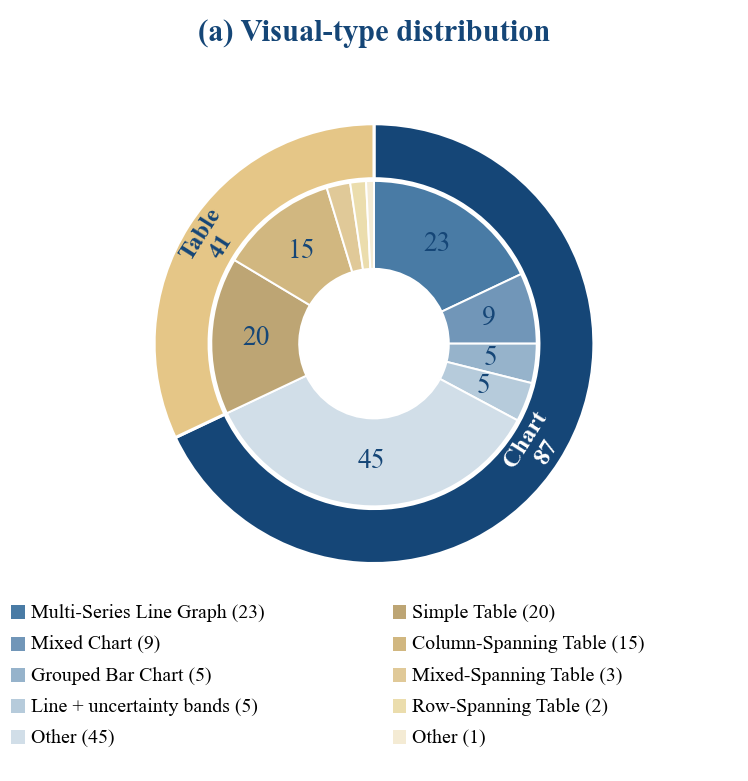
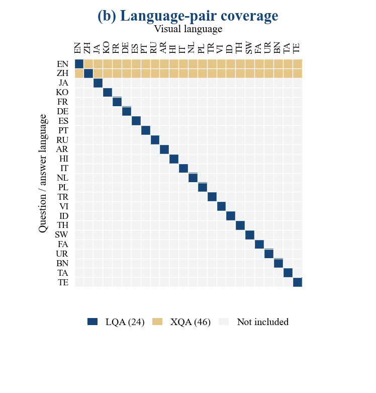
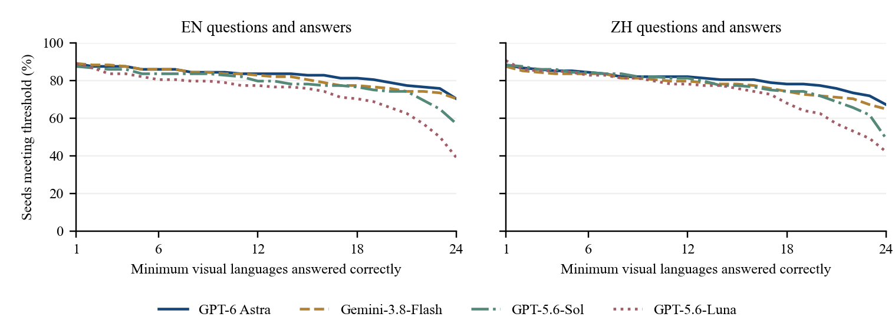

# MInfoVisQA

Anonymous research artifacts.

## Main results

Accuracy (%). XQA averages the 23 off-diagonal visual languages; AVG averages all 70 distinct configurations. Exact matches are accepted directly; remaining answers use the text-only GPT-6 Astra equivalence judge. Unconfirmed equivalence and failed requests count as incorrect.

| Model | XQA-ZH | XQA-EN | LQA-EN | LQA-ZH | LQA-JA | LQA-KO | LQA-FR | LQA-DE | LQA-ES | LQA-PT | LQA-RU | LQA-AR | LQA-HI | LQA-IT | LQA-NL | LQA-PL | LQA-TR | LQA-VI | LQA-ID | LQA-TH | LQA-SW | LQA-FA | LQA-UR | LQA-BN | LQA-TA | LQA-TE | AVG |
| --- | --- | --- | --- | --- | --- | --- | --- | --- | --- | --- | --- | --- | --- | --- | --- | --- | --- | --- | --- | --- | --- | --- | --- | --- | --- | --- | --- |
| gpt-6-astra | 80.3 | 82.5 | 86.7 | 85.2 | 83.6 | 84.4 | 82.8 | 84.4 | 82.8 | 82.0 | 84.4 | 82.0 | 79.7 | 84.4 | 84.4 | 83.6 | 82.0 | 83.6 | 82.0 | 81.2 | 85.2 | 82.8 | 79.7 | 82.0 | 81.2 | 77.3 | 81.9 |
| gpt-5.6-sol | 77.5 | 78.7 | 81.2 | 79.7 | 81.2 | 78.1 | 81.2 | 80.5 | 80.5 | 78.1 | 78.9 | 78.1 | 80.5 | 78.1 | 80.5 | 80.5 | 79.7 | 78.9 | 78.9 | 77.3 | 78.9 | 78.1 | 77.3 | 78.1 | 74.2 | 70.3 | 78.3 |
| google/gemini-3.8-flash | 78.1 | 81.3 | 82.8 | 78.1 | 80.5 | 82.8 | 83.6 | 79.7 | 80.5 | 80.5 | 84.4 | 78.1 | 82.8 | 81.2 | 81.2 | 78.1 | 79.7 | 84.4 | 80.5 | 79.7 | 78.9 | 79.7 | 77.3 | 80.5 | 76.6 | 77.3 | 79.9 |
| gpt-5.6-luna | 73.7 | 73.3 | 79.7 | 74.2 | 74.2 | 76.6 | 76.6 | 78.1 | 75.8 | 77.3 | 75.0 | 75.8 | 74.2 | 77.3 | 77.3 | 81.2 | 77.3 | 80.5 | 77.3 | 73.4 | 75.8 | 72.7 | 69.5 | 70.3 | 73.4 | 53.1 | 74.0 |
| gpt-5.5 | 71.8 | 75.5 | 79.7 | 73.4 | 77.3 | 79.7 | 78.9 | 75.0 | 74.2 | 76.6 | 78.1 | 75.0 | 74.2 | 78.9 | 74.2 | 77.3 | 75.8 | 80.5 | 75.0 | 71.1 | 74.2 | 73.4 | 70.3 | 70.3 | 68.8 | 61.7 | 74.0 |

## Dataset distribution

| Quantity | Count |
| --- | ---: |
| Seed questions | 128 |
| Languages | 24 |
| Language configurations per seed | 70 |
| QA instances | 8,960 |
| Localized images | 3,072 |
| Translation-invariant reference answers | 78 |
| Language-bearing reference answers | 50 |

| Source dataset | Seed questions |
| --- | ---: |
| CharXiv | 48 |
| ChartQA | 12 |
| ChartQAPro | 27 |
| MMTU | 9 |
| TableVQA-Bench | 22 |
| Visual-TableQA | 10 |

| Visual category | Seed questions |
| --- | ---: |
| Tables | 40 |
| Line graphs | 34 |
| Bars & lollipops | 15 |
| Composite visuals | 14 |
| Matrices & heatmaps | 6 |
| Pie & area charts | 6 |
| Distribution plots | 5 |
| Scatter & bubble plots | 4 |
| Field & phase plots | 4 |

The primary visual taxonomy has 40 tables and 88 other visuals. The coarser visual-family labels used by paired analysis have 41 table-family and 87 chart-family seeds, because one table–diagram composite belongs to the table family.

## Paired visual-language sensitivity

Changes are percentage points from the same-language baseline to the other 23 visual languages. Flip rates use all 128 × 23 pairs. This locally available analysis covers four models.

| Model | Charts Δ EN | Charts Δ ZH | Tables Δ EN | Tables Δ ZH | Correct→Wrong EN | Correct→Wrong ZH | Wrong→Correct EN | Wrong→Correct ZH |
| --- | ---: | ---: | ---: | ---: | ---: | ---: | ---: | ---: |
| GPT-6 Astra | -2.7 | -2.2 | -7.4 | -10.3 | 4.5 | 6.4 | 0.3 | 1.6 |
| Gemini-3.8-Flash | -1.2 | 1.3 | -2.2 | -3.0 | 3.2 | 2.9 | 1.7 | 2.9 |
| GPT-5.6-Sol | -2.2 | -1.4 | -3.3 | -3.9 | 4.4 | 6.2 | 1.9 | 4.0 |
| GPT-5.6-Luna | -4.4 | -0.9 | -10.5 | 0.3 | 8.5 | 6.4 | 2.1 | 5.8 |

